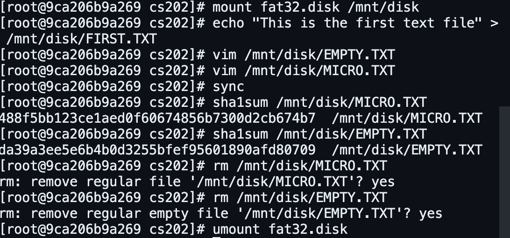

# nyufile


FAT32 has been around for over 25 years. Because of its simplicity, it is the most widely compatible file system. Although recent computers have adopted newer file systems, FAT32 (and its variant, exFAT) is still dominant in SD cards and USB flash drives due to its compatibility.

Have you ever accidentally deleted a file? Do you know that it could be recovered? In this lab, you will build a FAT32 file recovery tool called Need You to Undelete my FILE, or nyufile for short.

Milestone 1: validate usage. 
Milestone 2: print the file system information. 
Milestone 3: list the root directory. 
Milestone 4: recover a small file.
Milestone 5: recover a large contiguously-allocated file.
Milestone 6: detect ambiguous file recovery requests.
Milestone 7: recover a contiguously-allocated file with SHA-1 hash.

Multiple files whose names differ only in the first character would end up having the same name when deleted. Therefore, you may encounter more than one deleted directory entry matching the given filename. When that happens, your program should print filename: multiple candidates found (replace filename with the actual file name) and abort. 
To solve the aforementioned ambiguity, the user can provide a SHA-1 hash via command-line option -s sha1 to help identify which deleted directory entry should be the target file.

In short, a SHA-1 hash is a 160-bit fingerprint of a file, often represented as 40 hexadecimal digits. For the purpose of this lab, you can assume that identical files always have the same SHA-1 hash, and different files always have vastly different SHA-1 hashes. Therefore, even if multiple candidates are found during recovery, at most one will match the given SHA-1 hash. 

Also note that it is possible that the file is empty or occupies only one cluster. The SHA-1 hash for an empty file is da39a3ee5e6b4b0d3255bfef95601890afd80709. 

This tool only works with FAT32 file systems and does not take LFN (Long File Names) into consideration. Only 8.3

# Usage

Usage: ./nyufile disk <options>

-i    Print the file system information.

-l    List the root directory.

-r    filename [-s sha1]  Recover a contiguous file.

To Use:

To build ```make```

Note: It is recommended to run this tool in a virtualized environment such as a Linux Docker image due to its nature. My professor has provided one with this linuxKit image
```docker pull ytang/os``` which is what this was developed with.

your current directory will be placed in /cs202/ any changes outside of cs202 will not be reflected

To create a small FAT32 disk for program testing 


On Linux, /dev/zero is a special file that provides as many \0 as are read from it. The dd command performs low-level copying of raw data. Therefore, you can use it to generate an arbitrary-size file full of zeros. 

This will create a 256KB empty file named fat32.disk:
dd if=/dev/zero of=fat32.disk bs=256k count=1

Format the disk with FAT32:
mkfs.fat -F 32 -f 2 -S 512 -s 1 -R 32 fat32.disk


To use the FAT32 disk as if it were on your computer's file system mount it to a point
```mount fat32.disk /mnt/disk``` and when you are done unmount ```umount fat32.disk```.




#from Professor Yang Tang's Operating Systems Course @ New York University
